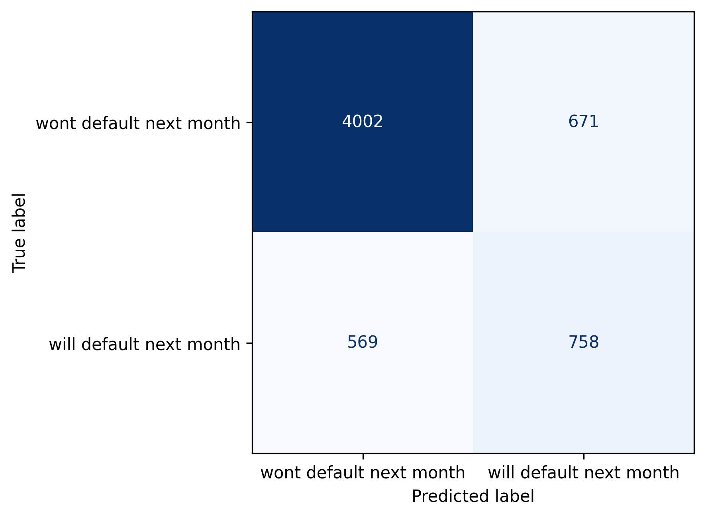
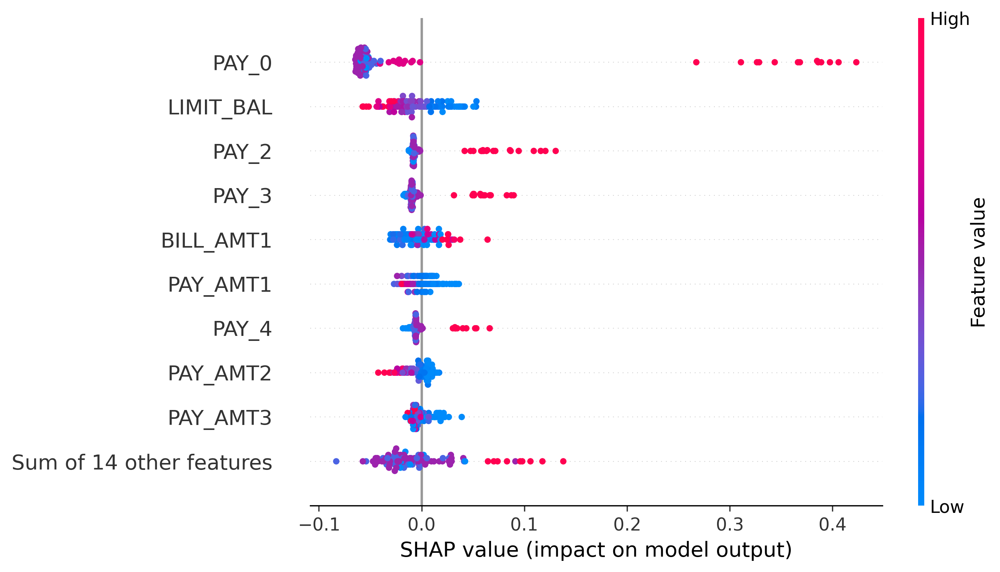
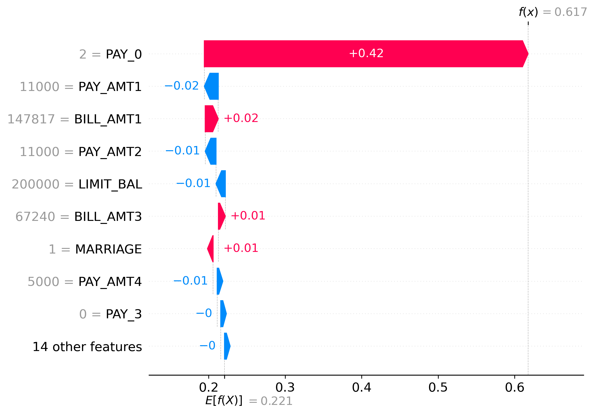
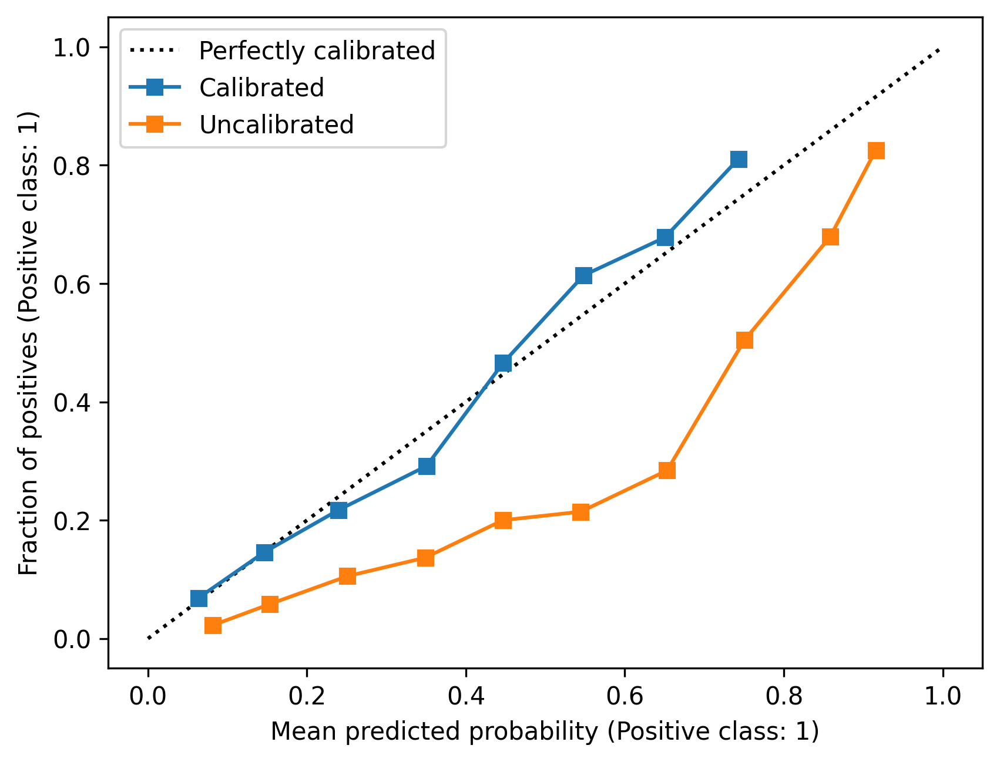

# Credit Default Prediction Pipeline

End-to-end machine learning pipeline to predict credit card default risk, using the [UCI Credit Card Default dataset](https://www.kaggle.com/datasets/uciml/default-of-credit-card-clients-dataset) (30,000 clients, 23 features).

## Overview

The goal is to produce a calibrated probability of default and an optimized decision threshold.
Calibration to ensure predicted probabilities reflect true risk, so 0.7 -> 70% default, while threshold tuning selects a 
threshold to balance the precision vs recall.  This enables the model to support risk ranking and binary classifcation tasks.


## Project Structure

```
credit-default-prediction-pipeline/
├── README
├── src/
│   ├── config.py           # Constants (SEED, paths)
│   ├── data_loader.py      # Data loading and train/test split
│   ├── preprocessing.py    # SchemaFixer, FeatureEngineer transformers
│   ├── metrics.py          # Scoring utilities, print_score, print_grid_result
│   ├── experiments.py      # Model dicts, param grids, experiment builder
│   ├── evaluate.py         # Core ML pipeline controlling model training and eval
│   └── results             # Cross-validation results across all experiments
├── notebooks/
│   └── eda.ipynb           # Exploratory data analysis
├── results/                # Stores experiment outputs and test results figures
└── data/
    ├── raw/                # UCI_Credit_Card.csv
    └── download.py         # Download UCI_Credit_Card.csv script
```

## Setup

#### Mac/Linux
```bash
python -m venv venv
source venv/bin/activate
pip install -r requirements.txt
```
#### Windows Powershell 

```bash
Set-ExecutionPolicy -Scope Process -ExecutionPolicy Bypass
python -m venv venv
venv\Scripts\Activate.ps1
pip install -r requirements.txt
```


#### Run
```bash
python -m src.evaluate
```
## Approach

**Preprocessing:** A `SchemaFixer` transformer corrects erroneous category codes in `EDUCATION` and casts categorical columns. A `FeatureEngineer` transformer adds aggregated payment behavior features (bill averages, delay trends, credit utilization, repayment ratios) on top of the raw features.

**Models compared:** Logistic Regression, Random Forest, and HistGradientBoosting, each evaluated with 5-fold stratified cross-validation. Gradient boosting models were further tuned with grid search, and the final model was wrapped in `CalibratedClassifierCV` to produce reliable probability estimates.

**Threshold tuning:** The classification threshold was optimized using sklearn's `TunedThresholdClassifierCV` on the training set to maximize F1 on the minority class.

**Explainability:** SHAP values computed on the final model to identify the most influential features.

## Results

### Cross-Validation Comparison (ROC-AUC, 5-fold stratified)

| Model | ROC-AUC | Avg Precision | Notes |
|---|---|---|---|
| Logistic Regression | 0.724 ± 0.008 | 0.498 | Baseline |
| Logistic Regression + FE | 0.749 ± 0.005 | 0.478 | FE helps LR meaningfully |
| Random Forest | 0.774 ± 0.004 | 0.541 | Baseline |
| Random Forest + FE | 0.781 ± 0.005 | 0.554 | Marginal FE gain |
| HistGradientBoosting + FE | 0.786 ± 0.007 | 0.553 | Best cross-val model |

### Final Model (HistGradientBoosting, calibrated, test set)

| Metric | Score |
|---|-------|
| Test ROC-AUC | 0.788 |
| Train ROC-AUC | 0.821 |
| Threshold | 0.289 |

| Class | Precision | Recall | F1    |
|---|-----------|--------|-------|
| Will not default | 0.876     | 0.856  | 0.866 |
| Will default | 0.530     | 0.571  | 0.550 |

### Visualizations





### Key Findings

- **Payment delay history dominates:** SHAP analysis confirms that recent payment delay status (`PAY_0` through `PAY_6`) are by far the most influential features. The most recent month (`PAY_0`) is the single strongest predictor.
- **Feature engineering helps linear models more than tree models:** Engineered features (delay trends, credit utilization, repayment ratios) improved logistic regression ROC-AUC by ~2.5 points but provided marginal gains for gradient boosting, which extracted equivalent signal from raw features directly.
- **Tree Based Models outperform linear baseline** RandomForest and HGB consistently outperformed Logistic Regression across CV.
- **Regularization over peak performance** Multiple tuned HGB configs (grid search) achieved similar CV results within variance.  The final model was selected for stronger regularization (higher min_sample_leaf, lower learning_rate) to prevent overfitting rather than to maximize scoring.
- **Calibration matters:** The Uncalibrated model produced poorly calibrated probabilities out of the box. The final HGB model wrapped in `CalibratedClassifierCV` produces reliable probability estimates suitable for risk ranking.
- **Threshold at 0.288:** Lowering the decision threshold from the default 0.5 to 0.288 improved recall on defaults from 0.387 to 0.571 (+47.5%), increasing the ability to detect risky clients at the cost of reduced precision from 0.705 to 0.530 (-24.8%), a tradeoff for risk management use case where missing a defaulter is more costly than a false alarm.


### Model: HistGradientBoostingClassifier (Calibrated)
#### HGB Key hyperparameters
- learning_rate: 0.05
- max_depth: None
- max_iter: 200
- l2_regularization: 0
- min_samples_leaf:500
#### Calibration hyperparameters
- method: sigmoid
- cv: 5